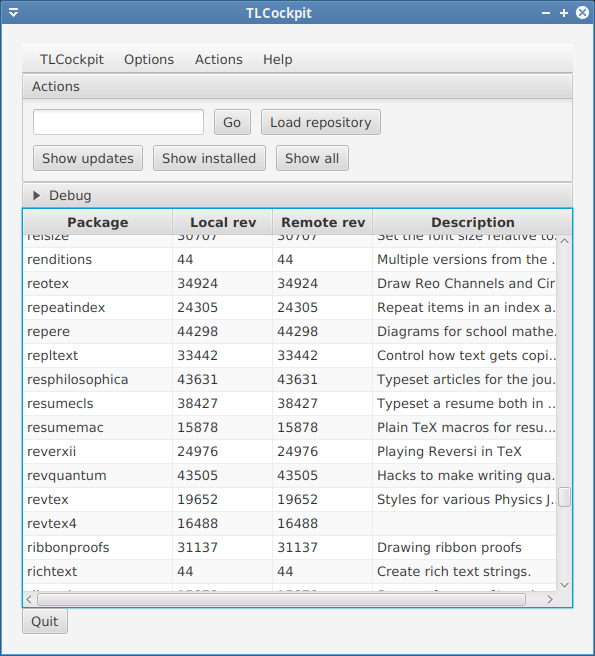
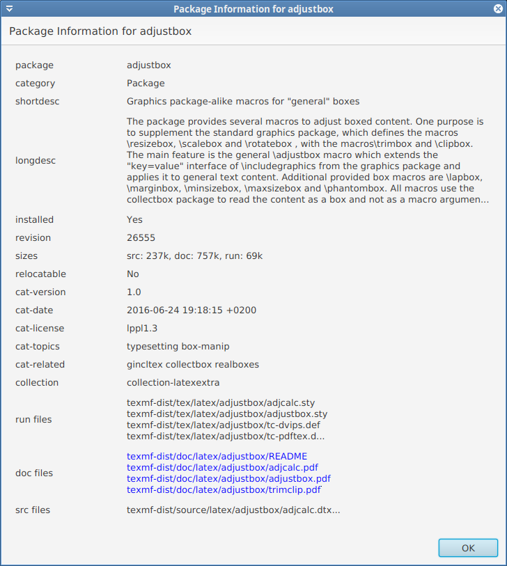

TLCockpit - GUI frontend to tlmgr
=================================

TLCockpit aims at being a GUI for [tlmgr](https://www.tug.org/texlive/tlmgr.html), the [TeX Live](https://www.tug.org/texlive/) Manager, with a modern look and feel.

TLCockpit is included in TeX Live, but you need the latest version of tlmgr, see the secion on <em>Test versions</em> in the above document.

Supported functionality
-----------------------

By now only loading of remote repository, listing installed, updated, 
or all packages. Clicking on a package in the list opens a details
window.

Furthermore, an input field allows entering arbitrary commands of the
*tlmgr shell*, see [tlmgr manual](https://www.tug.org/texlive/doc/tlmgr.html#shell) for details.

Installing/Running
------------------

If you don't want to build your own deployment jar (which I don't recommend),
download (tlcockpit.jar)[jar/tlcockpit.jar] and run it with

```
java -jar tlcockpit.jar
```

The `tlmgr` program has to be in the PATH, and be the most current version.

Development
-----------

Development is done in Scala with the ScalaFX widget set. The project is
mainly a challenge for myself to learn Scala. Building is done with *sbt*,
opening the project in IntelliJ works fine.

Deplyment is done via [sbt assembly](https://github.com/sbt/sbt-assembly)
which packs all the necessary libraries into one jar file.

Contributions are welcome, improvements are easily done as I just started
writing Scala and my style is horrible ;-)

Screenshots
-----------

Main window



Package details




License
-------

GPL3+


Author
------

Norbert Preining

