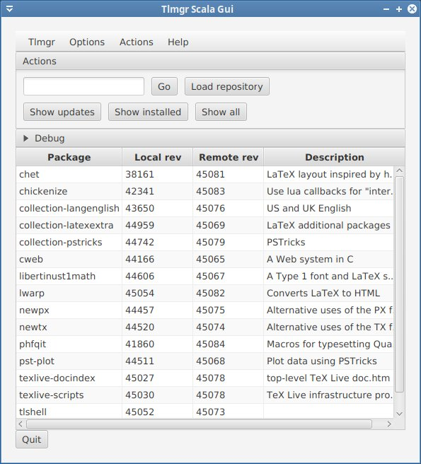

TLCockpit - GUI frontend to tlmgr
=================================

TLCockpit aims at being a GUI for [tlmgr](https://www.tug.org/texlive/tlmgr.html), the [TeX Live](https://www.tug.org/texlive/) Manager, with a modern look and feel.

TLCockpit is included in TeX Live, but you need the latest version of tlmgr, see the secion on <em>Test versions</em> in the above document.

Screenshots
-----------

License
-------

GPL3+

Author
------

Norbert Preining

