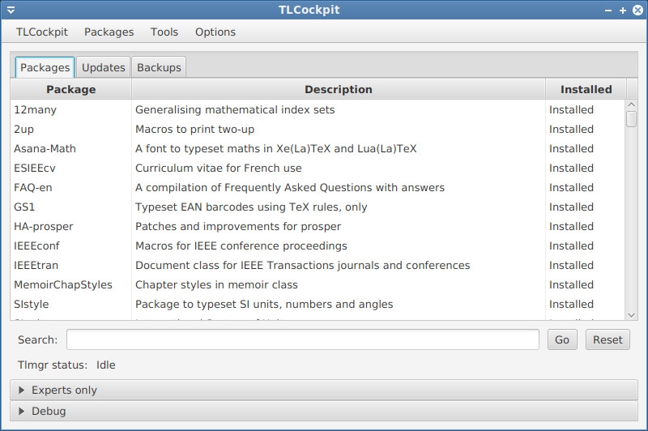
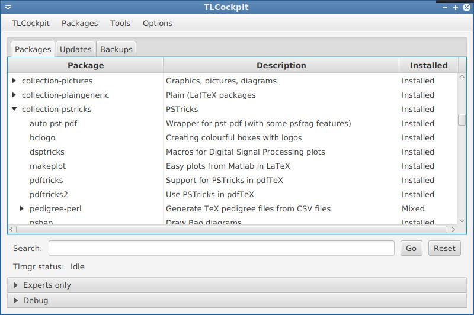

TLCockpit - GUI frontend to tlmgr
=================================


TLCockpit aims at being a GUI for [tlmgr](https://www.tug.org/texlive/tlmgr.html),
the [TeX Live](https://www.tug.org/texlive/) Manager, with a modern look and feel.
We take inspiration from the [TeX Live Utility](http://amaxwell.github.io/tlutility/).


Installing/Running
------------------

Since TLCockpit is included in TeX Live, it will be probably already installed
on your system. In case it isn't, a simple call to `tlmgr install tlcockpit`
should suffice.

We are providing new jar files on the github page, but update
the copy in TeX Live only at certain intervals. If you want to try out the latest
and greatest, get [tlcockpit.jar](jar/tlcockpit.jar) and put it into
`TEXLIVEROOT/texmf-dist/scripts/tlcockpit` replacing the current `tlcockpit.jar`.

After this you can run it by simply typing `tlcockpit`, or via a direct `java`
call as in `java -jar PATH/TO/tlcockpit.jar`.

Debugging can be enabled by passing the option `-d` or, for more detailed debugging `-dd`.

Requirements
------------
Currently TLCockpit is shipped with two jars, one for JDK8 and one for JDK9+.
The JDK8 version does *not* contain the JavaFX as it is normally shipped together
with the JDK. The JDK9+ version contains JavaFX modules and thus should work
without the need for additional installations.

The default for TLCockpit shell wrapper (used on Unix and Mac) is to check for the
version of Java (using `java -version`) and use the appropriate jar.

If you are running Java 8 and see the following errors
```
Error: A JNI error has occurred, please check your installation and try again
Exception in thread "main" java.lang.NoClassDefFoundError: javafx/event/EventTarget
	at java.lang.ClassLoader.defineClass1(Native Method)
	at java.lang.ClassLoader.defineClass(ClassLoader.java:763)
...
```
that means that the Java installation does not provides JavaFX.

On Windows the latest JRE from Oracle include JavaFX. On Linux one might
need to install some extra packages (Debian/Ubuntu: openjfx).

HiDPI support
-------------
Depending on your JDK version and operating system, Java might not correctly
detect the presence of a HiDPI screen.

Upgrading to JDK14 should help in this case.

For other versions, you might be able to fix it by setting the environment
variable
```
export GDK_SCALE=2
```
(or even `=3`) might help.

Development
-----------

Development is done in Scala with the ScalaFX widget set. The project is
mainly a challenge for myself to learn Scala. Building is done with *sbt*,
opening the project in IntelliJ works fine.

Deployment is done via [sbt assembly](https://github.com/sbt/sbt-assembly)
which packs all the necessary libraries into one jar file.

Contributions are welcome, improvements are easily done as I just started
writing Scala and my style is horrible ;-)

Screenshots
-----------

Starting up TLCockpit


Package listing



View packages by collections



Updates listing, with one package being updated


After updating all packages during the run of postactions like `mktexlsr`


Backup/Restore listing


Package details


Configuration dialog


Repository seup dialog with dropdown for mirror selection


Paper setting dialog


The Tools menu, as well as the expert and debug panes open


Copyright and License
---------------------

Copyright 2017-2020 Norbert Preining
Licenced under the GNU General Public License, version 3 or any higher version
(GPL3+)

Contributor Code of Conduct
---------------------------

This project adheres to No Code of Conduct. We are all adults. 
We accept anyone's contributions.  Nothing else matters.

For more information please visit the [No Code of Conduct](https://nocodeofconduct.com) homepage.

Author
------

Norbert Preining

